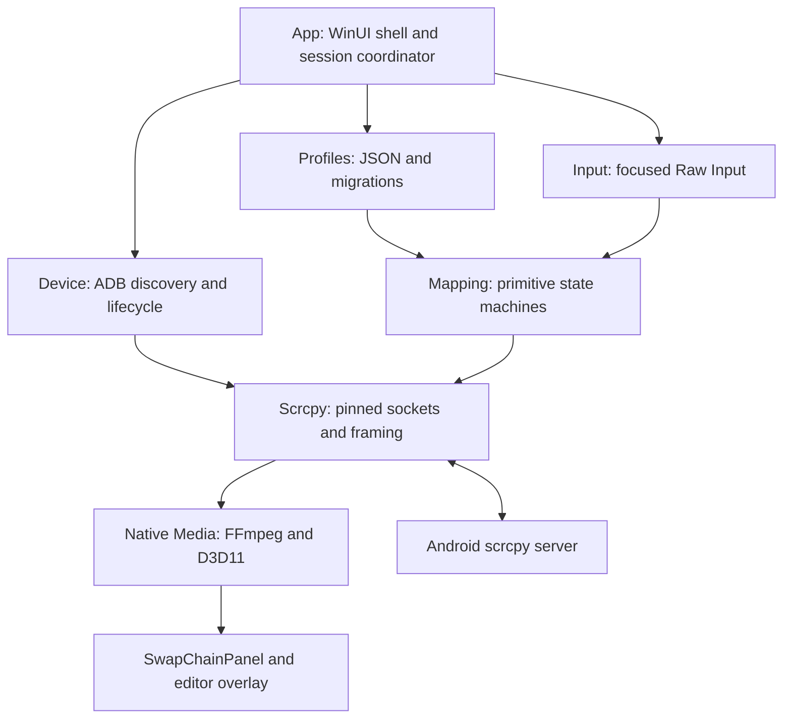

# MobileMapper architecture — Phase 0 decision

Decision date: 2026-10-08. Starting canonical main: `77cf44a675368137d2c84852129da42b664218f5`.

**Recommended architecture is selected. Research and offline experiments are complete;
Windows/Android acceptance is still open.** Start Phase 1 with the risk-validation slice
below, not a full editor. No production application or installer exists yet.
Evidence, alternatives and source links: [research](PHASE0_RESEARCH.md),
[licenses](THIRD_PARTY.md), [sources](SOURCES.md). Statements described as targets or
design policies are decisions, not measured performance.

## 1. Selected stack

| Concern | Decision | Reason / constraint |
| --- | --- | --- |
| Product baseline | Windows 11 x64; Android 11+ Wireless Debugging | Real devices, local network, no USB in normal flow. Windows 10/ARM64 are not initial acceptance targets. |
| Application | C# / .NET 10 LTS; WinUI 3 / stable Windows App SDK | Managed UI/state/profile code, Windows-native interop and composited video/editor surface. Official pages list .NET 10 and App SDK 2.5.1 at research time; pin exact SDK/NuGet versions in Phase 1. |
| Video host | WinUI `SwapChainPanel` | App-owned DirectX surface with ordinary XAML editor controls in the same visual tree. Not an embedded external process window. |
| Native media boundary | Small C++20 DLL, stable C ABI, CMake/MSVC | Own FFmpeg objects, D3D11 textures and COM lifetimes; avoid managed frame copies and avoid exposing FFmpeg ABI to C#. |
| Decode | FFmpeg shared `libavcodec` + `libavutil`; H.264 first; D3D11VA preferred, CPU fallback | One decoder interface, controllable packet feed, hardware capability probe. Hardware is a hypothesis to benchmark, not automatically faster. LGPL-only release configuration. |
| Render | D3D11 + DXGI composition flip swap chain, NV12/YUV shaders | GPU color conversion/scaling; render latest completed frame. No OpenGL/Vulkan layer needed on Windows. |
| Connection | App-controlled ADB CLI process adapter and ADB daemon, TLS wireless pairing/discovery | Reuse ADB authentication/mDNS instead of reimplementing either. No terminal UI. |
| Android agent | Unmodified scrcpy server **5.0.1**, commit `a60891aea193d92e7e5c3942700eca63f9d19a5f` | Temporary `app_process` server launched as shell, not an installed companion application. Host implements a deliberately small matching protocol subset. |
| PC input | Win32 Raw Input, focused Play mode, relative mouse deltas | Independent from XAML pointer event frequency and cursor position. |
| Android input | Long-lived scrcpy control socket, distinct finger pointer IDs | Ordered DOWN/MOVE/UP; shared touch allocator supports simultaneous primitives. |
| Profiles | Versioned JSON via `System.Text.Json`, normalized content coordinates | Human-portable files, explicit migrations, independent of device/window pixels. |
| Distribution | Self-contained directory, Inno Setup `MobileMapperSetup.exe`; portable ZIP later | Bundle .NET and Windows App SDK separately; native DLLs remain files. Exact ADB binary clearance remains a release gate. |

The two-language boundary is intentional: C# owns product behavior; C++ owns media
resources only. It must not acquire profile or game-specific logic. WinUI is chosen
for video/editor composition, not a claim that WPF or C++ is inherently too slow.

## 2. System and ownership boundaries



These are planned boundaries, not empty projects to generate immediately:

| Module | Owns | Must not own |
| --- | --- | --- |
| `MobileMapper.App` | WinUI/MVVM, pairing UI, selected device, session state, viewport/edit/play transitions | Codec buffers or touch wire bytes |
| `MobileMapper.Device` | ADB subprocesses, identity hints, discovery snapshots, timeouts, tunnel/server lifecycle | Mapping rules or UI controls |
| `MobileMapper.Scrcpy` | Version manifest, bootstrap, video parser, control writer and reverse reader | Game knowledge, keyboard bindings |
| `MobileMapper.Media.Native` | Decoder, textures, swap chain, GPU reset and CPU upload fallback | ADB keys or profiles |
| `MobileMapper.Input` | Scan codes, buttons, raw deltas, focus/capture/escape | Network I/O |
| `MobileMapper.Mapping` | Pure primitive state machines, ownership, coordinate math, scheduling | Windows APIs, ADB, game identifiers |
| `MobileMapper.Profiles` | Schema validation, migrations, atomic save/import/export | Active touch state |
| `MobileMapper.Diagnostics` | Bounded logs, timings, counters, redacted support export | Screenshots, key sequences, clipboard, secrets by default |

Key contracts: `SessionDescriptor` contains transport selection and generation;
`VideoGeometry` contains frame width/height and generation; `PhysicalInputEvent`
contains a monotonic timestamp, scan code/button/delta and input generation;
`TouchIntent` contains owner, action, normalized point and generation. The protocol
writer receives resolved frame coordinates and dimensions. Cross-module objects
are immutable snapshots; no access to mutable UI controls from worker threads.

UI thread handles UI and swap-chain attachment/detachment. A native media worker
serializes decode/render resources. A dedicated input message loop forwards small
events to a single mapping owner; a separate ordered control writer performs I/O.
The video receive task never waits on UI layout or mapping. Native APIs use opaque
handles, explicit create/destroy, status codes and bounded callbacks; no exceptions
cross the C ABI. Texture lifetimes stay in native code.

## 3. Wireless connection and credentials

### User flow

First use: explain enabling Developer Options and Wireless Debugging **on the phone**.
List mDNS pairing services, let the user identify the intended phone, then accept
its six-digit code. If discovery is unavailable, show separate labeled pairing
address/port fields. The code is sent to `adb pair <endpoint>` through redirected
stdin, not logged or persisted. Never automatically pair arbitrary discovered devices.

Later use: start the managed ADB daemon, inspect connected devices and fresh
`_adb-tls-connect._tcp` services, reconnect the saved device, launch the server and
show video. If multiple saved devices are available, ask which device to use;
only auto-select an explicitly preferred unambiguous device. One streaming device
per app instance initially. Every device command has an explicit selector.

The pairing service port and the connection service port are different endpoints.
Store a friendly name and authenticated identity hints, not IP:port as permanent
identity. Endpoints and mDNS instance suffixes may change. Reconcile saved records
with ADB's trust/known-host data and authenticated device properties; never trust a
matching display name alone. Do not parse private key material to identify devices.

ADB already provides TLS pairing and mDNS auto-connect [A1, A2]. It cannot guarantee
discovery through guest Wi-Fi isolation, multicast filtering, VPN/firewall rules,
or when Wireless Debugging is off. Restart/toggle/network changes trigger fresh
discovery, not repeated use of a cached pairing port. A friendly manual connection
endpoint fallback is exceptional, not the normal every-launch workflow. Re-pair
only when trust was revoked/lost; network failure alone does not imply lost pairing.

### Process policy

- Use an explicit bundled, hash-pinned ADB path, not whatever is first in `PATH`.
  Development can select an installed official Platform-Tools directory in settings.
- Prefer an app-owned daemon on a loopback-only nondefault ADB server port; pass
  `-P <port>` consistently. Probe/reserve/retry port conflicts and track ownership.
  No `-a`, no automatic `kill-server` against the user's shared daemon on 5037.
  Validate coexistence with Android Studio in Phase 1.
- Let ADB retain its standard per-user identity/trust files with user-only Windows
  ACLs. A separate daemon does **not** mean isolated keys. Do not copy keys into
  profiles or portable folders. Do not assume `ADB_VENDOR_KEYS` relocates storage.
  DPAPI is useful for app-owned secrets, but wrapping ADB's file in DPAPI would
  make it unreadable to the stock daemon. Preserve pairing across app upgrades.
- Validate endpoints/arguments; invoke through an argument list without a shell.
  Bound stdout/stderr, pair/connect timeout (initial policy 30 s / 10 s), cancellation,
  and output parsing. Never persist pairing codes or unredacted ADB traces.
- Poll discovery while the picker is open (initial policy 2 s), slow down otherwise;
  use device-state tracking for established sessions. Accept known output variants
  and extra metadata, but treat unknown formats as an actionable compatibility error.
  ADB 37.0.1 release notes replace older mDNS backend assumptions [A3].

### Session states and recovery

`Idle -> Discovering -> Pairing (if needed) -> Connecting -> StartingServer ->
Streaming`. Failures enter `Recovering`, `NeedsPairing` or `NeedsUserAction` with a
reason. `Stopping` is cancellable/idempotent cleanup, not an auto-reconnect trigger.
Reconnect uses capped exponential backoff with jitter (1, 2, 4, 8, up to 15 s),
fresh discovery, and cancellation on user disconnect. Avoid duplicate attempts.

Any stream/control failure closes the whole session: suspend mapping, release
locally held cursor/keys, attempt remote releases if the control socket remains
usable, then close sockets, remove only owned forwards, stop the owned server and
increment generation. Never replay old input after reconnect. Resume Play only
after neutral physical keys/buttons and an explicit user action.

## 4. scrcpy bootstrap and protocol boundary

Pin server version, source commit, artifact URL and SHA-256 together. Inspect
release provenance/checksum before use. The scrcpy wire protocol is internal;
there is no general negotiation or compatibility guarantee [S1]. Upgrades require
source diff review and golden fixtures, not replacing only the server file.

Bootstrap sequence for Phase 1 (adapter operations, not user instructions):

1. Validate an authenticated ADB transport and explicit serial/transport selector.
2. Generate a 31-bit session ID; push the verified server to an app/session-specific
   path under `/data/local/tmp` (not a game APK or installed package).
3. Create `adb -s <serial> forward tcp:0 localabstract:scrcpy_<8-hex-scid>`;
   retain the returned host port, scoped to this session.
4. Launch a long-lived shell with `CLASSPATH=<server-path> app_process /`
   `com.genymobile.scrcpy.Server 5.0.1` and options `scid=<8-hex-scid>`,
   `tunnel_forward=true`, `audio=false`, `control=true`, `video_codec=h264`,
   `max_size=1280`, `max_fps=60`, `video_bit_rate=8000000`,
   `clipboard_autosync=false`, `cleanup=true`. Keep metadata flags enabled;
   do not use `raw_stream=true`. These option names were checked in pinned source.
5. Connect loopback video socket; read the forward readiness byte. Then connect
   the control socket **before waiting for device metadata**: the server accepts
   all enabled sockets before sending that metadata. Audio is disabled, so exactly
   two sockets, video then control, are expected [S2].
6. Read the 64-byte device-name field on the first socket, then the four-byte video
   codec ID. Run independent video receive, control write and device-message read
   loops. Closing any loop tears down the session. Server logs are diagnostic only.

Forward mode avoids an inbound LAN listener and makes socket lifecycle explicit.
It does not eliminate TCP head-of-line blocking: both channels use the same ADB
transport underneath. No raw unauthenticated touch port is exposed over Wi-Fi.

The v5.0.1 video stream is **not** the old fixed codec+width+height header layout:

| Record | Big-endian layout |
| --- | --- |
| Session | 12 bytes: `u32 flags` (bit 31 set; bit 0 client-resize), `u32 width`, `u32 height` |
| Media | 12-byte header: `u64 flags/PTS` (bit 63 clear, bit 62 config, bit 61 keyframe, low 61 bits PTS), `u32 payload length`; then payload |

Maintain `read_exact` behavior across arbitrary TCP fragments. Validate codec,
dimensions, lengths and reserved flags before allocation. Initial local payload
cap: 16 MiB; reject unsupported data, do not guess another protocol version. Size
changes can occur midstream without a new socket. Reset decoder/config/render
resources and increment geometry generation on each session record [S3].

Cache codec configuration (SPS/PPS) and prepend/pass it to the next media access
unit according to the decoder adapter; see upstream packet-merger behavior [S4].
No container demuxing is needed. Drain server-to-client control messages even
with clipboard autosync disabled; implement only the pinned enabled message set,
length bounds and explicit unsupported-message handling. Clipboard/clipboard
synchronization, audio, UHID, virtual displays and recording are out of the first MVP.

## 5. Decode, render and latency policy

Android capture/MediaCodec -> scrcpy framing -> ADB/TLS TCP -> host framing ->
FFmpeg decoder -> D3D11 texture -> color conversion/viewport -> DXGI/SwapChainPanel.
No external scrcpy window, video process stdout copy loop, or XAML bitmap-per-frame.

Native worker creates an FFmpeg D3D11 hardware context on the chosen adapter.
Prefer a decoder/render device shared in native code; retain AVFrame references
until GPU use is complete and honor texture-array slices/synchronization. If the
decoder surface cannot be sampled directly, use a GPU copy/video processor into
a shader-readable texture. This is not a promised zero-copy path. CPU decode
uploads YUV planes to D3D11; do not make CPU readback the normal hardware path.
Hardware decode failure causes a controlled CPU retry with lower resolution;
device-removed errors rebuild media resources and pause input.

Attach/detach the composition swap chain on the XAML UI thread through
`ISwapChainPanelNative`; render/present on the owned worker with serialized resize
commands. Handle `CompositionScaleChanged` and actual panel size. SwapChainPanel
is not itself focusable and has backdrop/transparency restrictions [W1]; a
focusable Play surface and normal foreground XAML controls provide input/editor UI.
Prove overlay hit-testing and scaling before building the editor.

Start with a supported composition flip model and a bounded in-flight frame count;
use frame-latency waitable behavior only where the selected swap-chain API supports
it. Benchmark vsync/Present policy on the actual WinUI host; do not promise direct
scanout or assume HWND tearing flags apply to composition surfaces [W3]. Borderless
fullscreen is preferred to exclusive mode.

- H.264 baseline; initial max dimension 1280, 60 fps cap, 8 Mbit/s. Expose 4–12 Mbit/s
  and 1280/1600/1920 presets later. These are starting policies, not optimum values.
- HEVC can reduce bandwidth but requires device encoder and PC decoder support;
  defer until measured. AV1 likewise adds compatibility/encode-cost risk; no MVP
  dependency. Neither codec is automatically lower-latency. No OpenGL/Vulkan need.
- No intentional playback/jitter buffer initially. Keep at most one **decoded**
  pending frame, replacing obsolete frames. Do not discard arbitrary compressed
  interframes: that breaks reference chains. A stalled decoder requests/reset video
  or restarts the stream at config+keyframe, rather than growing an unbounded queue.
- Bound compressed work by bytes and age (starting threshold 100 ms); restart on
  sustained backlog, then offer a lower bitrate/resolution. Preserve config packets.
- PTS is a device clock. Use it for ordering/deltas, not `PC now - Android PTS` as
  an end-to-end latency estimate. Variable frame output when the scene is still
  must not be reported as a network disconnect merely because no picture arrived.

| Metric | Initial acceptance target, not a result | Measurement |
| --- | --- | --- |
| Moving scene rate | Near 60 fps on a suitable 60 Hz phone; 30 fps fallback | Received/decoded/presented counters over 10 min, thermal state recorded |
| Phone display to PC display | Median <=80 ms, p95 <=120 ms on good 5/6 GHz LAN | High-speed camera captures the same on-phone changing marker on both screens |
| Physical PC input to visible PC response | Median <=120 ms, p95 <=180 ms; stretch <100 ms median | Hardware/visible input marker and test-surface response in one camera recording, >=100 events |
| Local raw-input to control enqueue | p95 <=5 ms without network blocking | Host monotonic timestamps; report actual send duration separately |
| Resource stability | No unbounded queue/memory growth; no stuck contacts in controlled recovery tests | 30-minute session plus repeated interruptions |

Expect worse results under congestion, slow encoders and thermal throttling. Record
phone/Android/GPU/driver/router/band/channel/resolution/bitrate/codec for each run;
report median, p95, worst spikes and drops. Do not add component estimates together
and report them as measured glass-to-glass latency.

## 6. PC capture and Android touch lifecycle

Register keyboard/mouse Raw Input at the Win32 window/message boundary [W2].
Represent keys by scan code plus extended flags; maintain pressed sets and ignore
key-repeat for Tap. Batch high-frequency mouse events if needed, preserving total
relative delta; after reading the current `WM_INPUT`, buffered reads drain remaining
events. Sum deltas, never keep only the last delta of a 1000 Hz burst.

Play mode alone consumes mapped input. Edit/typing mode uses ordinary XAML events;
never also emit a direct screen click for a mapped mouse click. Default capture
is foreground-only; do not request background gameplay capture. A registered
emergency hotkey may work globally, but must handle registration conflicts and
is not a global key logger. Reserve Escape as local release independent of profiles.

Relative aim hides/confines the cursor to the active viewport using Windows APIs
and uses raw deltas, not repeated cursor warping. Recompute confinement after DPI,
resize and monitor changes. Alt+Tab, minimization, lock/suspend, device removal,
capture loss, mode exit, profile switch or escape immediately suspend mapping and
unclip/show the cursor. Do not suppress OS switching shortcuts. Focus transitions
are priority barriers in the same input generation so queued moves cannot re-arm.

Touch messages are 32 bytes [S5]: type=2, action, u64 pointer ID, i32 x/y,
u16 frame width/height, u16 fixed-point pressure, u32 action-button, u32 buttons.
All integers are big-endian. Use nonnegative per-contact IDs, avoiding upstream
reserved negative mouse/finger IDs. Use DOWN=0, MOVE=2, UP=1, finger button fields
zero, pressure 1 on active contact and 0 on release. The server maps IDs to Android
pointer indices, converts secondary DOWN/UP to POINTER_DOWN/POINTER_UP and builds
MotionEvents; the host must not pre-encode Android pointer indices. The inspected
server allows ten contacts; actual device/app behavior still needs verification [S6].

A single touch allocator owns all primitives and direct interaction. Each active
mapping owns its contacts; IDs cannot collide. Exhaustion rejects the new gesture
with feedback, never steals another contact. The control writer is single-owner
and bounded: DOWN/UP/barriers are lossless and ordered; adjacent MOVE updates for
the same pointer/generation can be coalesced, never across a release/press barrier.
Mouse deltas are accumulated before mapping. Start with a 120 Hz motion emission
cap; measure 240 Hz if worthwhile. DOWN/UP bypass that motion timer. Overflow
suspends the session instead of dropping a release or blocking the UI.

### Release limitations that must stay explicit

Normal suspension sends one UP per active pointer at its last known valid point,
then clears local state. A successful socket write is **not** acknowledgment of
Android injection. A broken link cannot deliver releases. On disconnect/crash,
stop the old server when reachable and establish a fresh session, but do not
claim that either TCP close or process exit guarantees Android/game touch release.
The pinned server does not provide a verified per-contact disconnect watchdog.
Nor is sending ACTION_CANCEL alone proven to reset its internal pointer table.

Rotation races can make an old-sized UP invalid. Pause on geometry change, drain
old input, attempt release while the old geometry is still valid; if already
changed, use refreshed geometry for best-effort releases, then reset the server
session before allowing new input. A video-session counter is not an Android
orientation angle: size-only data cannot distinguish a 180-degree rotation.
Use explicit profile orientation policy, and test display changes on hardware.
If a hard disconnect leaves an app stuck, the UI must explain recovery (interact
on the phone/reopen the affected app); silently declaring input released is wrong.
If stock behavior fails acceptance, a small documented server cleanup/watchdog
patch is an architecture follow-up, not something assumed complete here.

## 7. Coordinates and profiles

Canonical profile space is the **visible uncropped Android content**, normalized
`[0,1]` per axis, with reference aspect ratio and orientation. It is neither the
desktop nor physical Android panel pixels. Phase 1 disables client rotation,
crop and virtual displays to keep one visible-to-input geometry.

For video size `(W,H)` and physical panel area `(Pw,Ph)`, fit scale is
`min(Pw/W, Ph/H)`. Center the resulting viewport; reject letterbox clicks. Convert
XAML DIP coordinates to physical panel coordinates once using composition scale,
subtract the viewport offset, then normalize. Map `(u,v)` to
`(min(W-1,floor(u*W)), min(H-1,floor(v*H)))`. The control message carries current
**video** dimensions; scrcpy's server maps them back to display coordinates and
rejects stale geometry [S7]. Do not scale to native Android pixels twice.

Store joystick radii as a fraction of `min(W,H)`, not an ambiguous fraction of X.
A radius of .09 is circular on screen: pixel radius `.09*min(W,H)`, normalized
horizontal radius `r/W` and vertical radius `r/H`. Clamp endpoints to content.
Resolution change with the same aspect is automatic. Aspect/orientation changes
pause Play and request calibration or a matching profile variant; normalization
cannot repair an app rearranging its controls. Default orientation is locked per
profile. Optional explicit clockwise quarter-turn transforms are `(u,v)->(1-v,u)`;
do not apply that transform again to video already rotated by the server.

Illustrative model, **not a frozen schema or a shipped game profile**:

```json
{
  "schemaVersion": 1,
  "id": "example-layout",
  "name": "Two-stick layout",
  "content": {
    "referenceSize": [1920, 1080],
    "orientation": "landscape",
    "aspectPolicy": "require-calibration-on-change"
  },
  "bindings": [
    {
      "id": "movement",
      "type": "joystick",
      "keys": {"up": "KeyW", "left": "KeyA", "down": "KeyS", "right": "KeyD"},
      "center": {"x": 0.17, "y": 0.78},
      "radius": {"value": 0.09, "unit": "short-edge"},
      "opposites": "cancel",
      "releaseWhenNeutral": true
    },
    {
      "id": "aim",
      "type": "mouseAim",
      "activation": "MouseLeft",
      "center": {"x": 0.82, "y": 0.76},
      "radius": {"value": 0.08, "unit": "short-edge"},
      "mode": "relativeJoystick",
      "release": "onTriggerUp"
    }
  ]
}
```

Symbolic key names resolve to physical scan-code bindings with display labels;
layout-dependent text entry is a different feature. Validate finite coordinates,
radius bounds, unique IDs, trigger conflicts, gesture limits and capacity.
Profiles contain data only: no scripts, executables, external library paths or
ADB commands. Save atomically with recovery backup. Reject future unsupported
schema versions without overwriting them; migrations preserve the original.
Keep profiles in user app data, and settings/device records separately. No database
is necessary initially. App package metadata may label a profile; it must never
select special code branches inside the mapping engine.

## 8. Common mapping framework

Every primitive consumes physical edges/deltas plus a monotonic clock and emits
touch intents through the shared allocator. States are Idle, Active, Releasing and
Suspended; transitions are deterministic and independently testable. No game checks.

| Primitive | Activation / evolution / termination |
| --- | --- |
| Tap | One physical press produces DOWN then UP after a bounded configurable contact time; ignore key-repeat; no repeat loop. |
| Hold | Press allocates DOWN; held state retains pointer; release produces UP. |
| Joystick | First nonzero direction produces center DOWN then MOVE to direction × radius; opposite keys cancel; diagonals normalize; neutral produces UP by default. |
| Mouse Aim | Raw deltas update a clamped vector with sensitivity/deadzone; activation produces center DOWN then MOVE; trigger-up releases. A relative drag mode can instead integrate movement in a bounded drag region. |
| Swipe / Drag | One live user trigger starts one bounded path, or follows live pointer deltas; release/cancellation stops immediately. No arbitrary sequences, unattended loops or chained actions. |
| Concurrent input | Separate owners coexist; e.g. movement + aim + a third tap. This is coordination, not another game-specific primitive. |

Mouse Aim can feel FPS-like through relative capture, but Android receives touch
joystick/drag events, not a native FPS camera API. Model fire-on-release, fire-on-
press or a separate attack-button tap as generic profile lifecycle choices. A
release-to-fire stick uses the same pointer for aiming and release; do not allocate
a second contact on that stick. Re-arming requires a fresh authorized physical
trigger according to the profile, never an automatic firing loop. Some apps may
not permit movement/aim/extra actions simultaneously; that is a compatibility result,
not a reason to add a game-specific injection hack.

## 9. Packaging and upgrade boundaries

Phase 3 produces a signed Inno Setup installer with an unpackaged, self-contained
`win-x64` application directory. Publish both `.NET SelfContained=true` and
`WindowsAppSDKSelfContained=true`; include app-local native dependencies and their
redistributable CRT as permitted by their actual distribution terms [W4]. Native
Windows App SDK dependencies mean this is not promised as one standalone app EXE.
`MobileMapperSetup.exe` is the installer, not the complete portable application.

Include app DLLs, native media DLL, LGPL FFmpeg DLLs, pinned scrcpy server and a
cleared ADB subset with notices. The SDK ZIP as a whole is **not** approved for
blind rebundling. [THIRD_PARTY.md](THIRD_PARTY.md) tracks the actual inspected ZIP
and unresolved component/source mapping. No binaries are committed in Phase 0.

Portable mode later uses the same directory payload; explicit portable profiles
must not cause ADB private keys to travel with the folder. App signing and timestamped
installer signing are release requirements; SmartScreen/Defender reputation still
needs testing and signing does not guarantee no warning. Never ask users to disable
Defender. No automatic updater now: reserve signed manifest/version/hash checks,
rollback, protocol/server atomic upgrades and separate profile migrations for later.

## 10. Phase roadmap and first implementation order

Keep exactly the four product phases in README. Internal checkpoints below do not
create new phases.

| Phase | Internal order and acceptance |
| --- | --- |
| 0 — Foundation & Architecture | This decision, source/license review, offline protocol/geometry/state and software-decode experiments. Physical gates remain explicitly pending. |
| 1 — Wireless Mirroring MVP | (1) Minimal Windows risk slice below; (2) pairing/discovery/reconnect service and simple state UI; (3) sustained video and CPU/hardware fallback; (4) direct mouse-to-touch, interruption handling and actionable diagnostics. Exit only after no-terminal/no-USB reuse works on hardware. |
| 2 — Universal Key Mapping System | Pure mapping scheduler/allocator and fixtures; profile persistence/migrations; primitives including relative aim; editor with shared viewport math; multi-touch/focus/rotation acceptance across distinct app layouts. |
| 3 — Productization & Release | First-run polish, performance/compatibility matrix, fullscreen, distribution/license-source bundle, clean-machine installer/uninstaller/portable checks, signing and release documentation. |

**First Phase 1 implementation scope:** a single WinUI window with SwapChainPanel
and one overlay marker, a narrow C++ media DLL, the pinned server bootstrap,
wireless code pairing from UI, and a diagnostic three-contact test on a benign
touch-test surface. No editor, game profile or installer. Start with CPU decode
to establish correctness, then the D3D11VA path. Use an already-installed ADB for
developer tests until the redistributable artifact is cleared.

Before expanding this slice, demonstrate: fresh wireless pairing without USB,
video inside the app, correct direct tap coordinates at 100/150/200% DPI, independent
three-contact DOWN/MOVE/UP, safe focus release, disconnect/rotation recovery and a
latency baseline. A failed test is a blocker to the related implementation scope;
record evidence and revisit only the affected decision. Most urgent risks are
native GPU/WinUI composition, OEM input permissions, disconnect touch cleanup,
ADB coexistence/discovery and exact binary-license provenance. The hardware test
procedure and ownership are in [research](PHASE0_RESEARCH.md).

## Phase 1 implementation addendum (2026-10-09)

The selected architecture remains unchanged. Actual module boundaries, build and
unverified device gates are in [PHASE1_IMPLEMENTATION.md](PHASE1_IMPLEMENTATION.md).
Core houses the currently needed input/coordinates/diagnostics logic; Session
orchestrates Device/Scrcpy/Media. Unused Mapping/Profile projects are not created.

The first implementation uses CPU FFmpeg H.264 decode, a latest AVFrame slot,
libswscale BGRA conversion and D3D11 texture upload on a dedicated presenter thread.
D3D11VA is an extension point, not an implemented optimization. Phase 1 direct
interaction uses WinUI pointer events; Raw Input belongs to later relative-input work.
Compressed records are bounded by 8 records / 16 MiB queued bytes, with a 250 ms
backlog deadline triggering a clean restart. Native display state is generation-gated.
Input always resumes explicitly after focus/reconnect/rotation boundaries.

An app-owned foreground ADB daemon listens on an ephemeral loopback port; no shared
kill-server. Developer builds use a user-selected official Platform-Tools installation.
FFmpeg is built as shared LGPL-only libraries using pinned vcpkg; runtime license and
configure flags are checked by native tests. The developer package includes exact
source archives, vcpkg patches/recipe, component notices and generated hashes.
These implementation choices do not close physical input, latency or release gates.
